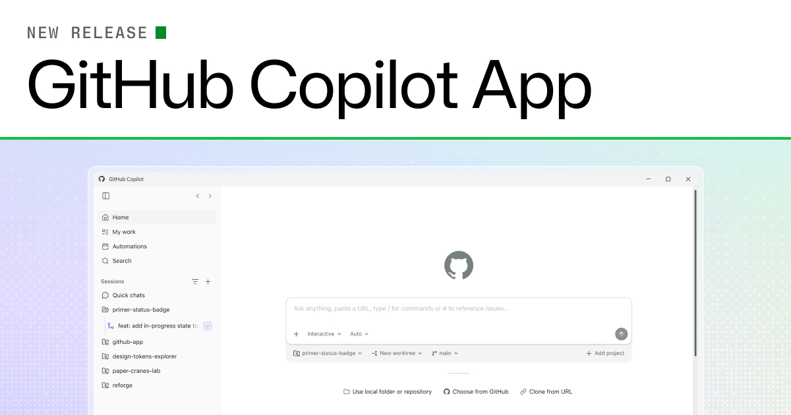

# GitHub Copilot App — Learning Repo



[](https://github.com/nisalgunawardhana)
[](https://github.com/nisalgunawardhana/github-copilot-app/stargazers)

A personal learning repository built from the official [GitHub Copilot App workshop](https://github-samples.github.io/copilot-workshops/app/).

The GitHub Copilot app is a desktop application built on Copilot CLI that brings agent-driven development into a single, focused workspace. It adds parallel agent sessions, switchable session modes, shared canvases, and native GitHub issue and pull request management — including **Agent Merge**, which shepherds a pull request through rebases, review feedback, CI fixes, and merge.

Across these lessons you'll install the app and set up your project, then get oriented in the app's workspace and the backlog the template seeded for you. You'll start with a small change — adding a star rating — then add a custom instructions standard from an issue, build a filtering feature in an isolated agent session, and verify it with a reusable skill. You'll add the Playwright MCP server to explore the feature in a real browser, then climb a ladder of merge automation that ends with Agent Merge landing your pull request. Finally you'll collaborate on a shared canvas and automate recurring work — a complete loop from idea to merged feature. An optional three-module extension uses Microsoft Foundry Canvas to prepare a project and model, build and deploy an agent, and connect it to the site.

## Lessons

| # | Lesson | Topic | Description |
|---|--------|-------|-------------|
| 0 | [Prerequisites](lessons/0-prerequisites.md) | Setup | Install Node.js and create your copy of the demo-student-management-system project |
| 1 | [Install the Copilot app](lessons/1-install-copilot-app.md) | Setup | Install the app, connect your project, and get oriented in the workspace |
| 2 | [Running your first agent session](lessons/2-add-star-rating.md) | First change | Start a session and ship a small change as your first pull request |
| 3 | [Guiding Copilot with custom instructions](lessons/3-custom-instructions.md) | Context | Add a documentation standard from an issue and merge it |
| 4 | [Building a feature with Autopilot](lessons/4-build-filtering.md) | Core Feature | Use Plan and Autopilot to build filtering, then verify it with a skill |
| 5 | [Testing with Playwright MCP](lessons/5-mcp-playwright.md) | External Tools | Add the Playwright MCP server and explore your feature in a browser |
| 6 | [Merging with Agent Merge](lessons/6-agent-merge.md) | Merge | Let Agent Merge fix and land your filtering pull request |
| 7 | [Planning with canvases](lessons/7-canvases.md) | Collaboration | Create a shared canvas to plan and track your work |
| 8 | [Incorporate Foundry (optional)](lessons/8-foundry-canvas.md) | AI agents | Prepare a project and model, build and deploy a grounded agent, and connect it to the site |
| 9 | [Review and next steps](lessons/9-review.md) | Summary | Automate recurring tasks and explore what's next |

## Prerequisites

Before starting this workshop, make sure you have:

- [ ] A GitHub account with an active Copilot Student, Pro, Pro+, Business, or Enterprise plan
- [ ] A computer running macOS, Linux, or Windows
- [ ] Git installed on your computer

> No paid plan? Verified students can get GitHub Copilot for free through [GitHub Education](https://github.com/education). The Copilot Student plan includes the agent, MCP, code review, and Copilot CLI features this workshop uses.

Because the Copilot app runs on your own machine rather than in a codespace, [Lesson 0](lessons/0-prerequisites.md) walks you through installing Node.js and creating your copy of the project before you install the app.

If you are using Copilot Business or Copilot Enterprise, your administrator must enable the Copilot CLI policy before you can use the app.

## Demo Project

The official workshop uses its own Tailspin Toys sample, but the lessons in this repo are written against a smaller, quicker project instead:

**[demo-student-management-system](https://github.com/nisalgunawardhana/demo-student-management-system)** — a small Next.js CRUD demo (students, `data.json`) built specifically for trying out the GitHub Copilot app.

To use it:

1. Open the repo and select **Fork** (top right) to create your own copy
2. Clone your fork locally and run `npm install`
3. Open the GitHub Copilot app and add your forked repository (see [Lesson 1](lessons/1-install-copilot-app.md))
4. Work through the lessons against this project: start a session, ask Copilot to add a feature (e.g. a new field or filter on the student list), review the diff, test with `npm run dev`, and open a PR

This gives you a low-stakes repo to experiment with sessions, Plan/Autopilot modes, custom instructions, and Agent Merge. If you'd rather follow the official workshop exactly, see [Lesson 0](lessons/0-prerequisites.md) for the Tailspin Toys setup instead.

## Repository Structure

```
github-copilot-app/
├── README.md              # This file — workshop overview and lesson index
├── lessons/                # One markdown file per lesson, with embedded screenshots
│   ├── 0-prerequisites.md
│   ├── 1-install-copilot-app.md
│   ├── 2-add-star-rating.md
│   ├── 3-custom-instructions.md
│   ├── 4-build-filtering.md
│   ├── 5-mcp-playwright.md
│   ├── 6-agent-merge.md
│   ├── 7-canvases.md
│   ├── 8-foundry-canvas.md
│   └── 9-review.md
└── images/                 # Screenshots captured from the workshop site
```


## ⚖️ License

This project is licensed under the MIT License - see the [LICENSE](LICENSE) file for details.

---

## 🌐 Connect with Me

Follow me on social media for updates and more learning resources:

[](https://twitter.com/thenisals)
[](https://linkedin.com/in/nisalgunawardhana)
[](https://instagram.com/thenisals)

**Happy Learning! 🎉**

Remember: Making mistakes is part of learning. Don't be afraid to experiment and try new things!