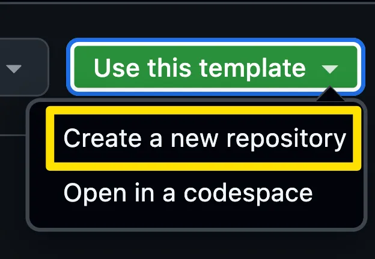
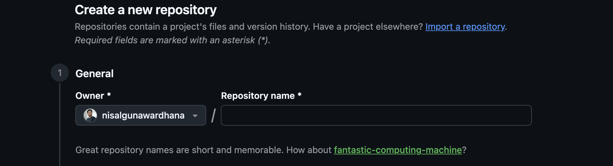

# Lesson 0 — Prerequisites

**Topic:** Setup
**Goal:** Install Node.js and create your copy of the demo-student-management-system project

## Overview

The GitHub Copilot app serves as a central hub for Copilot and GitHub, providing access to issues and pull requests. In this repo, we work locally with **[demo-student-management-system](https://github.com/nisalgunawardhana/demo-student-management-system)** (built on Next.js) and the GitHub Copilot app, instead of the official workshop's Tailspin Toys sample.

> The screenshots below are from the official workshop and show the Tailspin Toys template. The steps are the same for demo-student-management-system — just fork the repo instead of using "Use this template".

Because the Copilot app runs on your own machine rather than in a codespace, this lesson walks you through installing Node.js and creating your copy of the project before you install the app in Lesson 1.

## Learning Objectives

- Install Node.js to run the project's tests locally
- Create a personal copy of the demo-student-management-system project

## Install Node.js

Install version 22 or newer — the current LTS release is a safe choice. Node.js is the only runtime requirement for the project.

1. Visit the official [Node.js download page](https://nodejs.org/)
2. Download the LTS build for your operating system
3. Run the installer with default settings
4. Open a **new** terminal window and verify the install:

```bash
node --version
```

Confirm the output shows version 22 or higher.

> **Docker users:** the repository includes a dev container that bundles Node.js, so you can skip the local install if you prefer working in a container.

## Create Your Copy of the Project

1. Navigate to [`https://github.com/nisalgunawardhana/demo-student-management-system`](https://github.com/nisalgunawardhana/demo-student-management-system)
2. Select **Fork** (top right) to create your own copy

   

3. Confirm the fork details and create it under your own account

   

4. Clone your fork locally and run `npm install`

## Next Steps

Continue to [Lesson 1 — Install the Copilot app](1-install-copilot-app.md) to install the GitHub Copilot app and connect your newly created repository.
