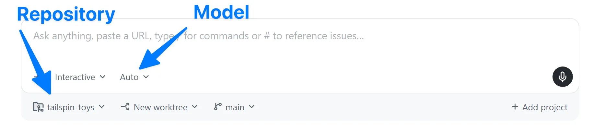
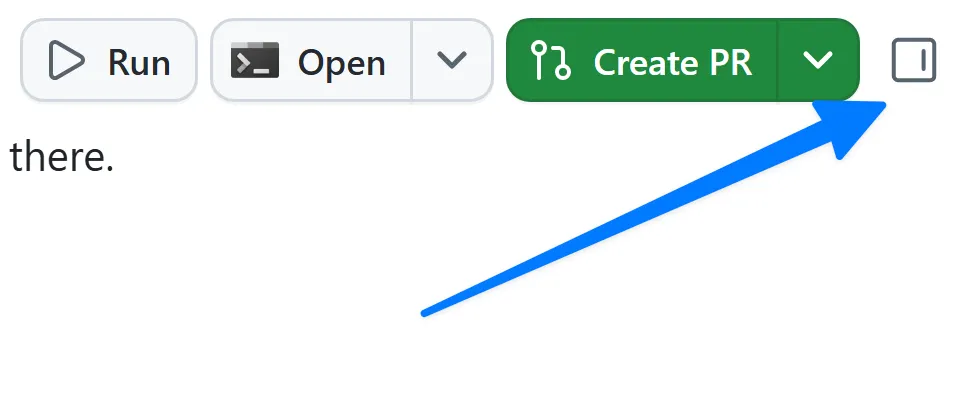
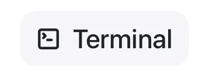

# Lesson 2 — Running Your First Agent Session

**Topic:** First change
**Goal:** Start a session and ship a small change as your first pull request

## Overview

This lesson teaches you how to start your first agent session in the GitHub Copilot app and implement a small feature change.

> The screenshots below are from the official workshop and show Tailspin Toys (game cards, star ratings). In this repo we work with `demo-student-management-system` instead — the same session workflow applies to a small change on the student list, such as adding a status badge to each student card.

## Key Concepts

A **session** is a conversation with an agent that runs in its own isolated workspace. Each session gets a dedicated git worktree and branch, allowing multiple concurrent sessions without conflicts. Sessions appear in the sidebar grouped by repository and display three main components: the conversation, the agent's tool activity, and changed files with diffs.

## Implementation Steps

1. Start a new session with the repository selector set to your `demo-student-management-system` fork

   

2. Request the feature with a specific prompt that identifies the file to modify (e.g. the student card component). Ask the agent to show each student's status, or display "No status set" when the field is empty.

3. After Copilot generates code, review the changes in the diff view. The expected output includes conditional rendering logic that displays ratings with styling or a fallback message. Use the **Toggle review panel** button to open the diff view.

   

## Testing and Deployment

Use the built-in terminal to run the dev server and verify changes work in the browser.



```bash
npm run dev
```

Open `http://localhost:3000` to confirm the change renders correctly.

Then:

1. Create a pull request
2. Wait for workflows to complete
3. Merge your changes

## Summary

You've successfully:

- Started an agent session
- Directed the agent to make a focused change
- Reviewed the modifications
- Tested locally
- Merged your first pull request

## Next Steps

Continue to [Lesson 3 — Guiding Copilot with custom instructions](3-custom-instructions.md).
