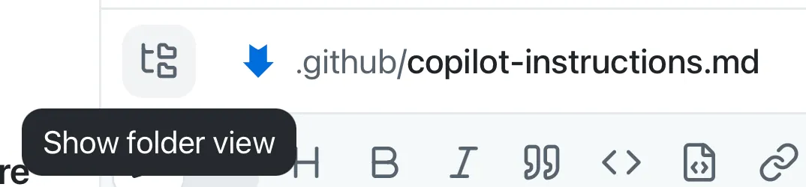

# Lesson 3 — Guiding Copilot with Custom Instructions

**Topic:** Context
**Goal:** Add a documentation standard from an issue and merge it

## Overview

This lesson teaches how to use instruction files to guide GitHub Copilot's behavior and output. The core concept centers on providing context through repository-level and task-specific instruction files.

> "Custom instructions allow you to provide context and preferences to Copilot, so that it can better understand your coding style and requirements."

## Types of Instruction Files

- **`.github/copilot-instructions.md`** — project-wide guidance
- **`.github/instructions/*.instructions.md`** — files for specific tasks or file types

## Learning Objectives

- Explore how instruction files reach the agent
- Start a session from an issue
- Request Copilot add documentation standards
- Merge the resulting pull request

## Scenario

The demo-student-management-system project is establishing development guidelines requiring TSDoc comments and enforced formatting standards.

## Best Practices

- Keep `.github/copilot-instructions.md` focused on project-level information
- Use path-scoped instruction files for specific languages or tasks

## Workflow

1. Review existing instruction files. Use the **Show folder view** button in the review panel to browse the repo while a file is open.

   

2. Start a session directly from the relevant issue using the **New session** button in the issue view.

   

3. Ask Copilot to generate the instruction file updates based on the issue's requirements.
4. Review the changes on the **Changes** tab of the session panel.

   

5. Merge the pull request to the default branch.

## Next Steps

Continue to [Lesson 4 — Building a feature with Autopilot](4-build-filtering.md).
