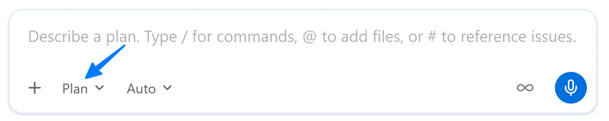
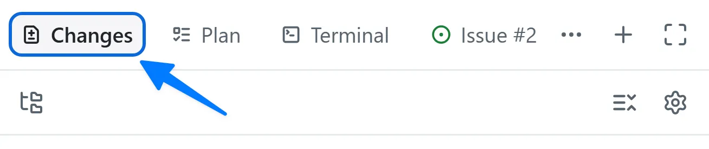

# Lesson 4 — Building a Feature with Autopilot

**Topic:** Core Feature
**Goal:** Use Plan and Autopilot to build filtering, then verify it with a skill

## Overview

This lesson introduces building features using the GitHub Copilot app's Autopilot capability, while integrating AI coding agents into existing development workflows and maintaining quality standards.

## Learning Objectives

1. Begin a fresh session from a filtering issue
2. Use Plan mode for feature planning, then Autopilot for implementation
3. Verify generated code adheres to documentation standards and passes quality checks

## Scenario

The demo-student-management-system homepage displays all students without filtering options. The requirement is to implement class and status filters using Copilot.

## Development Process Framework

> "Open a filed issue with details of what needs to be done. Create a plan of what needs to be built. Build and review the code. Run the tests to validate the code. Manually validate the new functionality. Create a pull request (PR). Once the code has been reviewed and the continuous integration process succeeds, merge the code."

This ensures AI-generated code undergoes the same vetting as manually written code.

## Session Modes Explained

Three operational modes control agent autonomy:

- **Interactive** — collaborative approach where agents suggest changes and await approval
- **Plan** — agent creates plans for review before execution
- **Autopilot** — fully autonomous operation including code writing, testing, and iteration

## Feature Planning Process

1. Access **My work** navigation
2. Select the filtering issue
3. Create a new session

   

4. Switch to **Plan** mode using `Shift+Tab`

   

5. Request: "Plan the work based on the requirements documented in the issue. Please ask any clarifying questions you might have as you build the plan."

The agent may ask clarifying questions — answer based on your implementation preferences.

## Implementation Phase

After plan approval, select an approval option like **Approve and implement with autopilot**. The agent autonomously handles file creation, editing, writing tests, and iteration over several minutes.

## Code Review Process

1. Select the **Changes** tab

   

2. Examine the new TypeScript, React, and test files
3. Verify TSDoc comments and file headers match established documentation standards
4. Open the terminal to run the dev server

   

5. Test the feature at `http://localhost:3000`
6. Stop the server with `Ctrl+C`

## Agent Skills Introduction

> "Agent skills let you give Copilot guidance on how to perform repeatable tasks like running tests, generating builds, or creating pull requests."

Skills follow an open standard, stored in `.github/skills` folders. Each skill contains a `SKILL.md` file with YAML frontmatter including `name` and `description`.

## Quality-Checks Skill

The project includes a skill defined as:

> "Run the project's test suites and linter to verify code changes are ready to commit, push, or merge."

Skills are dynamically loaded based on scenario-specific descriptions in the `description` field.

## Verification Workflow

1. Open the review panel

   

2. Add a new file item
3. Search for and open `SKILL.md` in `.github/skills/quality-checks`
4. Review the skill documentation for test execution order and debugging guidance
5. Return to Copilot and use the slash command `/quality-checks`
6. The agent runs unit tests, linter, and end-to-end tests sequentially

## Resources Referenced

- Working with agent sessions in the GitHub Copilot app
- About Agent Skills
- Customizing the GitHub Copilot app
- About cloud and local sandboxes for GitHub Copilot

## Next Steps

Continue to [Lesson 5 — Testing with Playwright MCP](5-mcp-playwright.md), which integrates the Playwright MCP server for browser-based testing.
