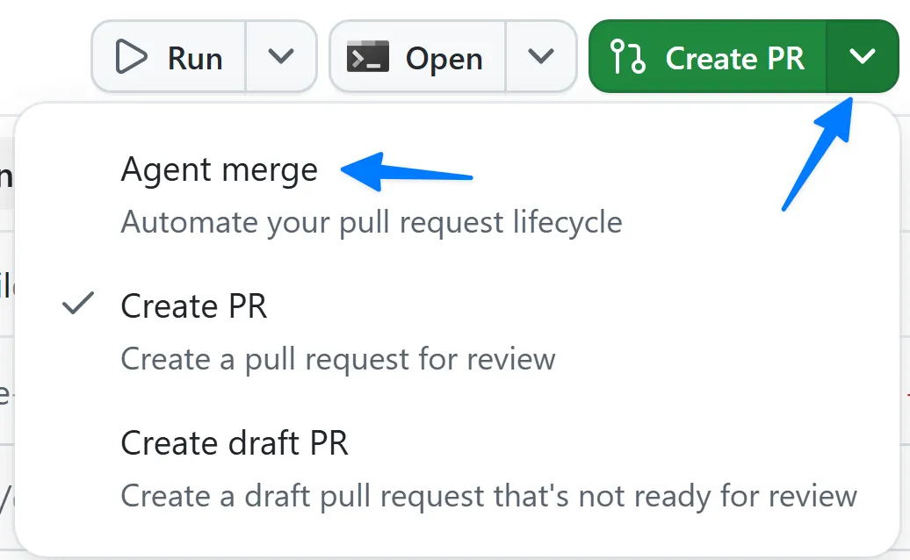
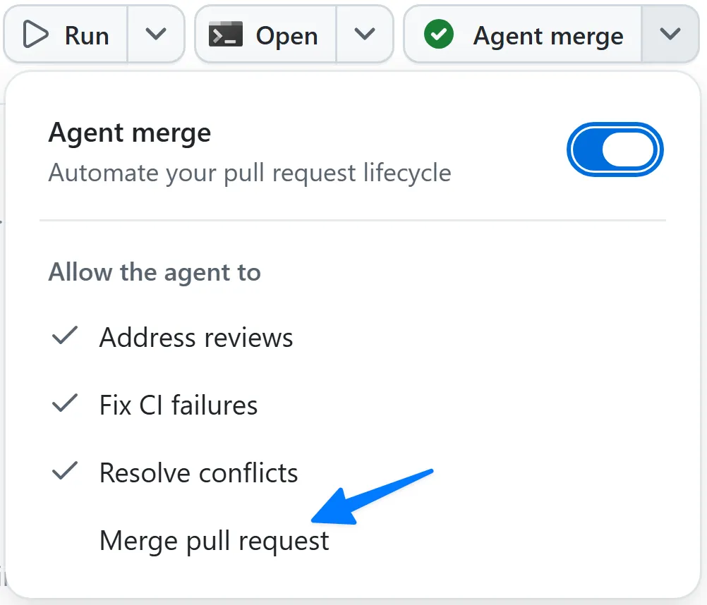

# Lesson 7 — Planning with Canvases

**Topic:** Collaboration
**Goal:** Create a shared canvas to plan and track your work

## Overview

This lesson teaches how to use canvases — shared, interactive surfaces for work artifacts — within the GitHub Copilot app. The focus is on creating a Kanban board to triage issues for the Tailspin Toys project.

## Learning Objectives

- Understand what canvases are and their purpose
- Create a shared Kanban triage board
- Save and merge it to the repository
- Open it in a new session to begin work

## Scenario

The Tailspin Toys development team seeks a tool to quickly triage issues and begin work within the Copilot app, addressing the challenge of managing a daunting list of issues.

## Canvas Definition

A canvas is "a shared, interactive surface for a work artifact — a plan, a triage board, a release checklist, a dashboard, or a document." Canvases operate bidirectionally, allowing both agents and users to update the same surface.

## Common Canvas Examples

- Markdown canvases for daily planning and prioritizing issues
- Agentic kanban boards for collaborative work management
- Issue triage boards summarizing repository concerns

## Canvas Benefits

Canvases prove valuable "when a task needs structure, iteration, and verification, and a chat alone isn't enough." They ground agent work in actual artifacts, enable direct correction on shared surfaces, and provide visible progress indicators.

## Step-by-Step Instructions

### Creating the Canvas

1. Launch the Copilot app and select the `tailspin-toys` repository
2. Provide a prompt requesting a Kanban board highlighting the three most urgent issues, with descriptions and justification, plus remaining items below, with buttons to add issues to the current context

### Saving and Merging

1. Request that Copilot save the canvas to the repository
2. Enable Agent Merge through the **Create PR** dropdown

   

3. Initiate the merge process

   

4. Copilot explores the project, creates the PR, monitors CI processes, and automatically merges once checks pass

### Working with the Canvas

1. Start a new session
2. Request Copilot open the triage canvas
3. Select **Add to current context** on an issue of interest
4. Copilot begins work on it

## Summary

This lesson demonstrates creating collaborative surfaces where users and agents work together, encompassing canvas creation, repository integration, and practical application in new sessions.

## Next Steps

Continue to [Lesson 8 — Incorporate Foundry (optional)](8-foundry-canvas.md) or skip ahead to [Lesson 9 — Review and next steps](9-review.md).
